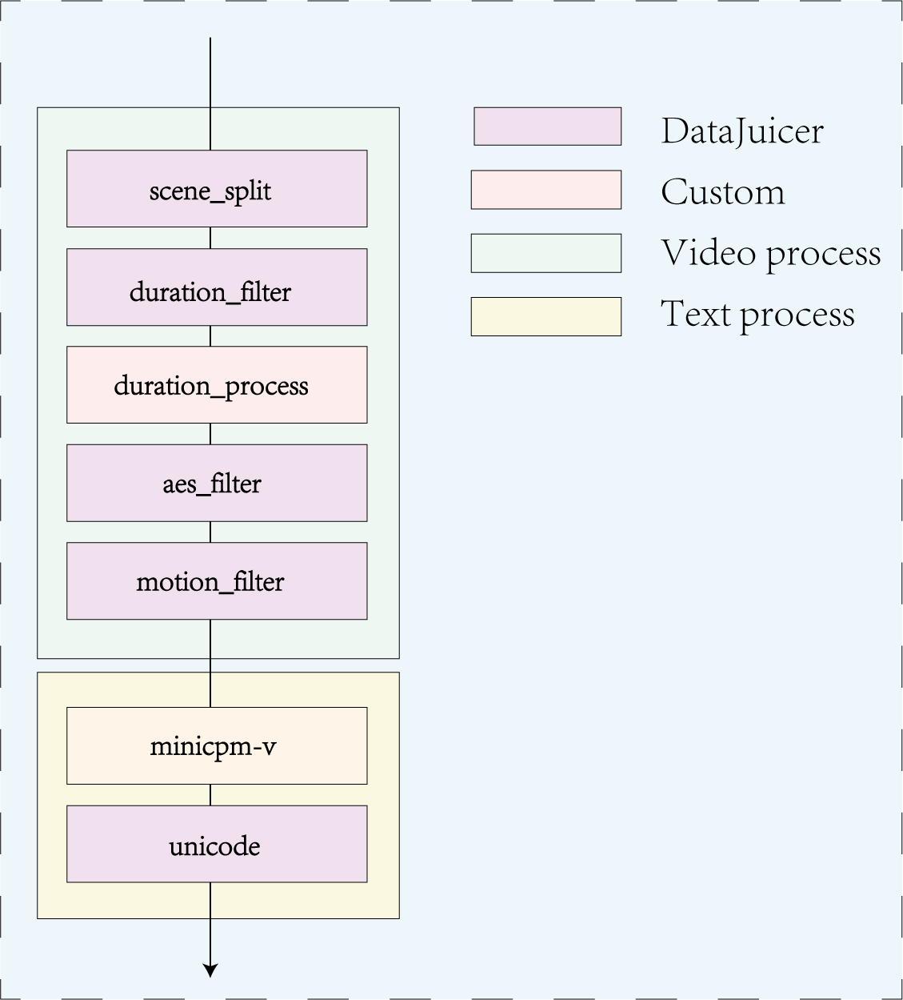

# Modelscope-Sora
Modelscope-Sora Challenge 第四名解决方案

主要思路是先对视频进行处理，包括场景分割，时长过滤，美学评分过滤，运动评分过滤；然后对视频的描述进行生成，先使用MiniCPM 用指定prompt生成 caption，然后进行Unicode修复，单词重复过滤，然后进行训练。

## 视频处理
### 1.1 场景分割
使用 PySceneDetect 的 ContentDetector 将视频拆分为场景剪辑。

### 1.2 时长过滤
保留视频时长在 3 到 10 秒之间的数据样本。

### 1.3 时长进一步处理
移除不符合时长要求的视频,并更新文本中的占位符。

### 1.4 美学评分过滤
根据从视频中提取的帧图像的美学评分过滤样本。

### 1.5 运动评分过滤
保留视频运动分数在特定范围内的样本。

## 文本处理
### 2.1 MiniCPM 生成 caption
使用 MiniCPM-V-2_6 模型为视频生成描述。
代码借鉴自 https://huggingface.co/openbmb/MiniCPM-V-2_6

### 2.2 Unicode 修复
修复文本中的 Unicode 错误,删除重复的句子,并过滤单词重复比例超出特定范围的文本。
